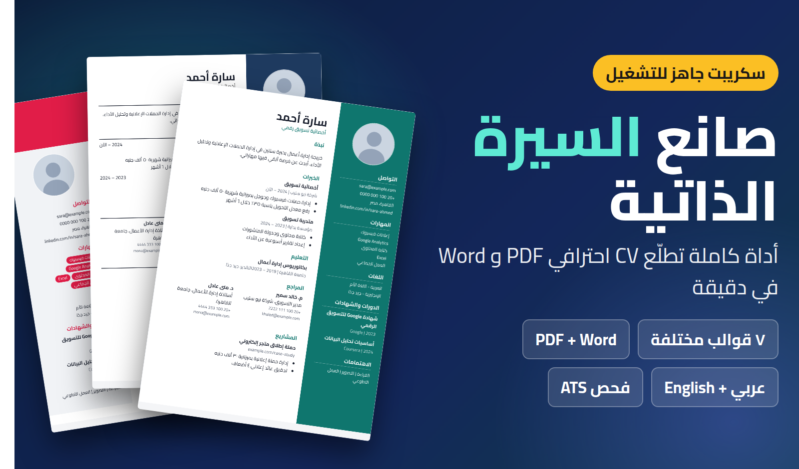
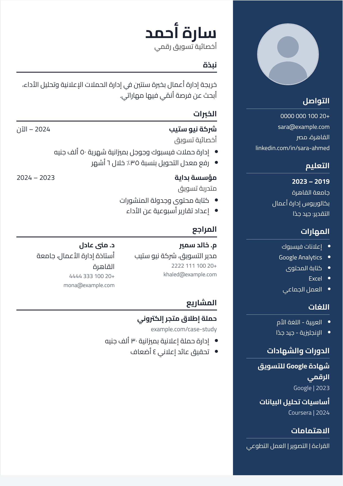
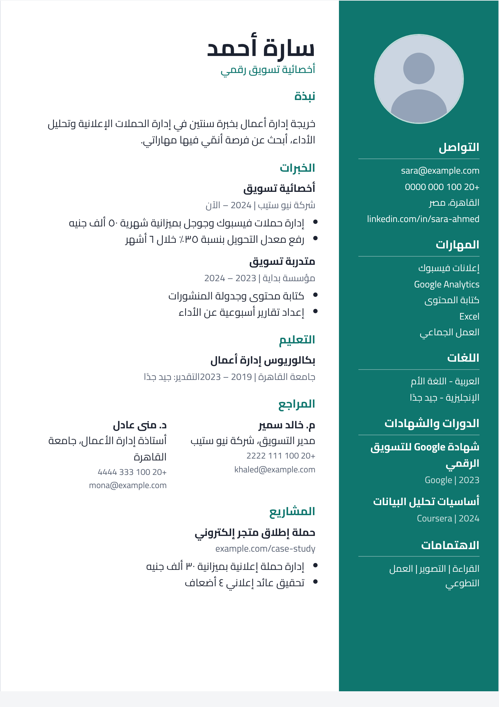
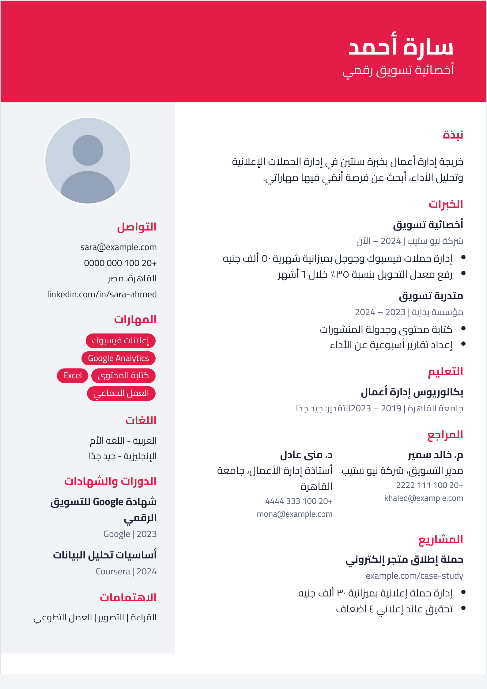
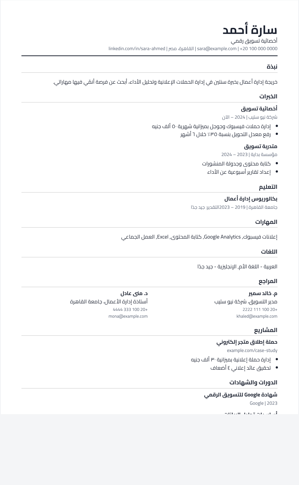

<div align="center">

# CV Builder — صانع السيرة الذاتية

أداة تفاعلية تنشئ **سيرة ذاتية احترافية PDF وWord** من متصفحك، بالعربي والإنجليزي، بدون سيرفر وبدون قاعدة بيانات.



**HTML5 · CSS3 · JavaScript** — مشروع خالص بدون Backend

</div>

## نظرة سريعة

المستخدم يملأ بياناته في فورم، يشوف السيرة تتشكل لحظة بلحظة، يختار القالب واللون، ثم يحمّلها PDF أو Word. بياناته بتتحفظ تلقائيًا على جهازه فقط.

**التجربة الحية:** `https://ahmedhassanhamed.github.io/cv-builder/` _(تعمل بعد تفعيل GitHub Pages، شوف الأسفل)_

## المزايا

- **7 قوالب مختلفة:** عصري، بسيط (متوافق مع ATS)، تنفيذي، إبداعي، خط زمني، مضغوط، احترافي (شريط جانبي وصورة).
- **معاينة حية** أثناء الكتابة، وحفظ تلقائي في `localStorage`.
- **خانات كاملة:** بيانات شخصية، صورة، خبرات، تعليم، مهارات، لغات، مشاريع، شهادات ودورات، اهتمامات، مراجع.
- **تصدير PDF** بمقاس A4 (عبر نافذة الطباعة: Save as PDF) و**Word (.docx)** حقيقي بمكتبة `docx`.
- **خطاب تقديم** يتولد من نفس البيانات.
- **فحص توافق ATS:** قائمة فحص بقواعد بسيطة، مش ذكاء اصطناعي.
- **شريط اكتمال السيرة** مع اقتراح الناقص، وزر «جرّب بمثال».
- **عربي (RTL) وإنجليزي (LTR)**، ووضع ليلي، واختيار لون الهوية.
- **ترتيب الأقسام والخبرات بالسحب والإفلات**، وباقات ألوان ومهارات جاهزة حسب المجال.
- **QR Code** للبورتفوليو أو LinkedIn، واستيراد نص LinkedIn (تحليل نصي بسيط، مش ربط API).
- **ملاءمة الصفحة تلقائيًا** لتظهر السيرة متوازنة في صفحة A4، وزر «مسح الكل» مع تراجع.

## القوالب

|                    احترافي                    |                  عصري                   |                  إبداعي                   |                 ATS                  |
| :-------------------------------------------: | :-------------------------------------: | :---------------------------------------: | :----------------------------------: |
|  |  |  |  |

## التشغيل

مفيش تثبيت ولا أدوات بناء:

1. حمّل أو انسخ المشروع.
2. افتح `index.html` في المتصفح (أو استخدم إضافة Live Server في VS Code).

> يحتاج اتصال إنترنت لتحميل مكتبتي Word وQR وخط Cairo من CDN. للعمل بدون إنترنت حمّل الملفات وضعها في فولدر محلي وغيّر المسارات في `index.html`.

## هيكل المشروع

```
cv-builder/
├── index.html          # الهيكل: الهيدر، الفورم، المعاينة، الفوتر
├── all.css/style.css   # كل التنسيقات (القوالب، الطباعة، الوضع الليلي)
├── all.js/
│   ├── lang.js         # النصوص العربي/الإنجليزي والبيانات التجريبية
│   └── script.js       # المنطق: الحالة، القوالب، التصدير، ATS، السحب...
├── assets/             # الشعار وصور الفوتر
└── docs/               # صور الشرح
```

## التخصيص

- **الألوان:** المتغير `--accent` في `style.css`، أو اللون من الشريط العلوي.
- **النصوص والترجمة:** `all.js/lang.js` (كائن `I18N`).
- **الفوتر والشعار:** في `index.html` وفولدر `assets/`.
- **قالب جديد:** أضف دالة داخل `TEMPLATES` في `script.js` واربطها بخيار في قائمة القوالب.

## المكتبات الخارجية

- [docx](https://github.com/dolanmiu/docx) `8.5.0` لتصدير Word.
- [qrcode-generator](https://github.com/kazuhikoarase/qrcode-generator) `1.4.4` للـ QR.
- خط [Cairo](https://fonts.google.com/specimen/Cairo) من Google Fonts.

## الخصوصية

كل البيانات بتتحفظ في متصفح المستخدم فقط (`localStorage`)، ولا تُرسل لأي سيرفر.

## الترخيص

© 2026 Ahmed Hassan — جميع الحقوق محفوظة. راجع ملف [LICENSE](LICENSE) لشروط الاستخدام وإعادة البيع.

## المطوّر

**Ahmed Hassan** — [Portfolio](https://ahmedhassanhamed.github.io/AhmedHassanHamed/) · [GitHub](https://github.com/AhmedHassanHamed) · [Khamsat](https://khamsat.com/user/hassanhamed_cz) · [Mostaql](https://mostaql.com/u/Ahmed_Hassan_CZ)

---

## English summary

**CV Builder** is a client-side web app (HTML/CSS/JS, no backend) that builds professional CVs with live preview, 7 templates, Arabic RTL + English, PDF (A4 via print) and real `.docx` export, a cover-letter generator, a rule-based ATS checklist (not AI), drag-and-drop section ordering, QR code and auto-save. Open `index.html` to run it. Proprietary — see `LICENSE`.
